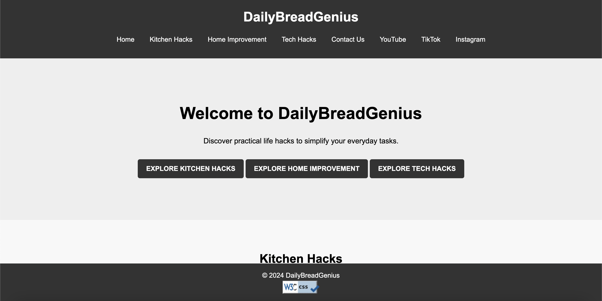

# LifeHacksGenius

## Table of Contents
1. [Introduction](#introduction)
2. [Project Rationale](#project-rationale)
3. [Key Project Goals](#key-project-goals)
4. [Target Audience](#target-audience)
5. [Features](#features)
6. [Deployment](#deployment)
7. [External Sources](#external-sources)
8. [Screenshots](#screenshots)
9. [Testing](#testing)
10. [Contributing](#contributing)
11. [License](#license)

## Introduction

LifeHacksGenius is a web application designed to provide users with a collection of practical life hacks to make everyday tasks easier. From kitchen shortcuts to home improvement tips and tech tricks, LifeHacksGenius offers innovative solutions to common challenges.

## Project Rationale

The development of LifeHacksGenius was motivated by the need to create a centralized platform for users to access a wide range of life hacks across different categories. In today's fast-paced world, people are constantly looking for efficient ways to manage their daily tasks. LifeHacksGenius aims to simplify users' lives by providing them with quick and effective solutions to common problems.

## Key Project Goals

1. **Provide Valuable Content**: Deliver high-quality content that offers practical solutions to everyday challenges in various aspects of life.
2. **User-Friendly Interface**: Design an intuitive and easy-to-navigate interface that allows users to quickly find relevant information.
3. **Engage Users with Multimedia**: Incorporate videos and images to engage users and enhance their learning experience.
4. **Encourage Interaction**: Create a contact form to encourage user feedback, questions, and suggestions.
5. **Responsive Design**: Ensure the website is accessible and functional across different devices and screen sizes.

## Target Audience

LifeHacksGenius targets individuals who are seeking efficient and innovative ways to simplify their daily tasks. The target audience includes:

- Busy professionals looking for time-saving techniques.
- Homeowners interested in DIY home improvement projects.
- Cooking enthusiasts seeking kitchen shortcuts and recipes.
- Tech-savvy individuals seeking tips and tricks for gadgets and devices.
- Students and learners interested in practical life hacks.

## Features

### 1. Home Page
The home page provides an overview of the website and its purpose. Users can learn about the different categories of life hacks available.

- **Implementation**: Implemented in `index.html`.
  
### 2. Kitchen Hacks
The kitchen hacks page offers various tips and tricks to simplify cooking and food preparation.

- **Implementation**: Implemented in `kitchen.html`.

### 3. Home Improvement Hacks
The home improvement hacks page presents practical tips for improving the home environment.

- **Implementation**: Implemented in `home-improvement.html`.

### 4. Tech Hacks
The tech hacks page offers innovative solutions to everyday tech-related issues.

- **Implementation**: Implemented in `tech.html`.

### 5. Contact Us
The contact page allows users to send inquiries or feedback via a contact form.

- **Implementation**: Implemented in `contact.html`.

### Future Features
- **User Accounts**: Allow users to create accounts to save their favorite life hacks and submit their own hacks.
- **Search Functionality**: Implement a search feature to help users quickly find specific life hacks.
- **Rating and Commenting System**: Allow users to rate and comment on life hacks, providing feedback and additional tips.
- **Social Sharing**: Add social sharing buttons to allow users to easily share life hacks with their friends and followers.
- **Newsletter Subscription**: Allow users to subscribe to a newsletter to receive regular updates on new life hacks.
- **Weekly Featured Hacks**: Showcase a new set of featured life hacks each week, curated by our team, covering various categories and interests.

## Deployment

The site was deployed to GitHub Pages. Below are the steps taken to deploy the project:

1. **GitHub Repository Setup**:
   - Create a new repository on GitHub.

2. **Local Development**:
   - Develop the project locally, ensuring all files, including HTML, CSS, JavaScript, and assets, are properly structured and functional.

3. **Commit Changes**:
   - Add, commit, and push all changes to the GitHub repository.

4. **GitHub Pages Configuration**:
   - Navigate to the GitHub repository's Settings tab.

5. **Select Source Branch**:
   - In the Settings tab, scroll down to the GitHub Pages section.
   - From the Source section drop-down menu, select the main branch.

6. **Confirmation**:
   - Once the main branch is selected, the page will automatically refresh, displaying a detailed ribbon indicating the successful deployment.

7. **Accessing the Deployed Site**:
   - The deployed site will be available at the following URL: [LifeHacksGenius](https://nanaantwii.github.io/LifeHacksGenius/index.html).

## Credits

### Content
- The content for the life hacks was compiled from various sources, including:
  - [Lifehack.org](https://www.lifehack.org/)
  - [BuzzFeed](https://www.buzzfeed.com/)
  - [DIY & Crafts](https://www.diyncrafts.com/)

### Media
- The images used in this project were obtained from the following sources:
  - [Unsplash](https://unsplash.com/)
  - [Pexels](https://www.pexels.com/)
  - [Pixabay](https://pixabay.com/)

### External Help
- Special thanks to the following resources for providing guidance, tutorials, and code snippets:
  - [Bootstrap Documentation](https://getbootstrap.com/docs/5.0/getting-started/introduction/): For styling and layout components.
  - [Font Awesome](https://fontawesome.com/): For providing icons used throughout the web application.
  - [YouTube](https://www.youtube.com/): For embedding videos demonstrating various life hacks.

## Screenshots

(Insert screenshots here)

## Testing

#### Functionality Testing
- **Contact Form Submission**: 
  - Tested the contact form by entering valid data and submitting.
  - Verified that the form submits without errors.
  - Confirmed that the confirmation message appears after successful submission.
  - Tested the form with invalid data (e.g., empty fields, incorrect email format) to ensure appropriate error handling.

- **Navigation**:
  - Clicked on each navigation link to verify that it correctly navigates to the intended page.
  - Checked that the links open in a new tab as expected.

- **Dropdown Menu**:
  - Hovered over the dropdown menu to verify that the items highlight and are clickable.
  - Clicked on each dropdown item to ensure it navigates to the correct page.

- **Clickable Links**:
  - Hovered over clickable links to verify that the cursor changes to a pointer.
  - Clicked on each link to ensure it navigates correctly.

- **Form Input Fields**:
  - Clicked on form input fields to ensure they focus correctly.
  - Entered data to verify that the input fields accept user input.

#### Compatibility Testing
- **Browsers**: 
  - Tested on Google Chrome, Mozilla Firefox, Safari, and Microsoft Edge.
  - Verified that the site looks and works correctly across all browsers.

- **Screen Sizes**:
  - Tested on various screen sizes including desktop, tablet, and mobile.
  - Ensured responsiveness by adjusting the screen size and checking layout changes.

#### Validator Testing
- **HTML**:
  - Passed through the official W3C validator with no errors.

- **CSS**:
  - Passed through the official (Jigsaw) validator with no errors.

#### Unfixed Bugs
- The "405 Not Allowed" error persists when submitting the contact form.
  - This issue may be related to server-side configuration or PHP code.
  - Unable to fix due to limitations in understanding server configurations.

### Conclusion
The testing conducted ensured that the website's functionality works as intended, providing users with an easy and straightforward experience. The site is responsive across different devices and browsers. Despite efforts, the "405 Not Allowed" error in the contact form submission remains unresolved due to limitations in fixing server-side configurations.

## Contributing

Contributions to LifeHacksGenius are welcome! If you find any issues or have suggestions for improvements, please feel free to open an issue or submit a pull request.

## License

This project is licensed under the MIT License. See the [LICENSE](./LICENSE) file for details.
